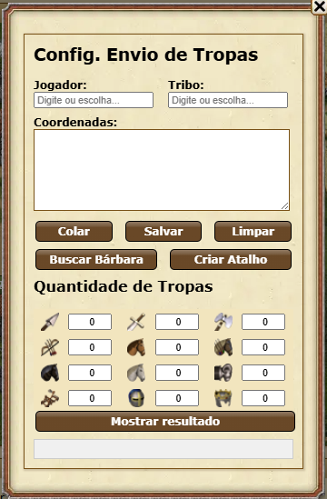

# 🛡️ Configuração de Envio de Tropas no Tribal Wars

Este script fornece uma interface prática e completa para configurar tropas e coordenadas no jogo **Tribal Wars**. Ele permite ao jogador salvar combinações de tropas, importar coordenadas por jogador ou tribo, visualizar um resumo da configuração e muito mais.

## 🔧 Funcionalidades

- Interface intuitiva com painel flutuante (`Dialog.show`)
- Definição rápida de tropas por tipo (Ex: Lanceiro, Machado, Cav. Leve, etc.)
- Busca automática de coordenadas por:
  - Nome do jogador
  - Nome da tribo
- Pré-visualização das tropas configuradas
- Salvamento local das configurações (LocalStorage)
- Colagem direta da área de transferência
- Botões auxiliares para:
  - Buscar aldeias bárbaras (`BuscaBB.js`)
  - Criar atalho rápido (`CriaAtalho.js`)

## 📷 Captura de Tela



## 🗂️ Estrutura do Painel

- **Jogador/Tribo**: Auto-preenchimento com `datalist`
- **Coordenadas**: Textarea para edição manual ou colagem
- **Tabela de Tropas**: Inputs numéricos por unidade
- **Botões de Ação**:
  - `Colar`: Cola coordenadas da área de transferência
  - `Salvar`: Salva tropas e coords no navegador
  - `Limpar`: Reseta o painel
  - `Buscar Bárbara`: Carrega script externo para busca
  - `Criar Atalho`: Gera um atalho rápido para envio
  - `Mostrar Resultado`: Exibe uma prévia da configuração

## 🧠 Como Funciona

O script coleta as informações do mundo atual do jogo (`map/village.txt`, `map/player.txt`, `map/ally.txt`) e permite filtrar aldeias de jogadores ou tribos para facilitar o envio de tropas em massa.

A estrutura de dados local salva coordenadas e tropas usando `localStorage`, permitindo persistência mesmo após recarregar a página.

## ▶️ Como Usar

1. Copie o conteúdo de `ConfigTropas.js`.
2. Execute no console do navegador, ou crie um marcador (bookmarklet) com o seguinte formato:

```javascript
javascript:(function(){ $.getScript('https://tribalwarstools.github.io/ConfigTropas/ConfigTropas.js'); })();
